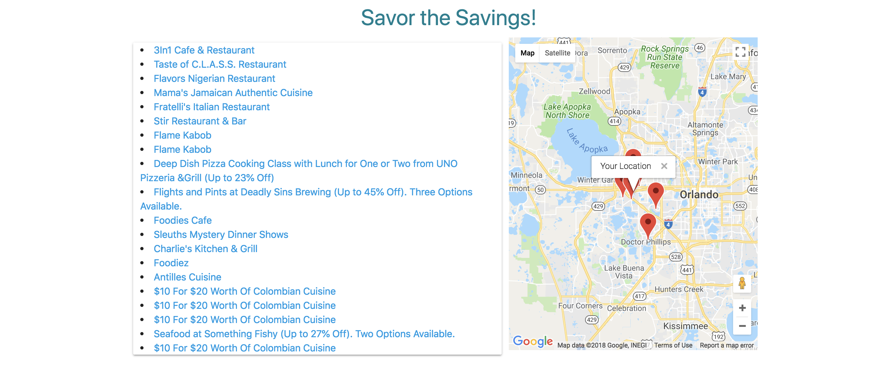
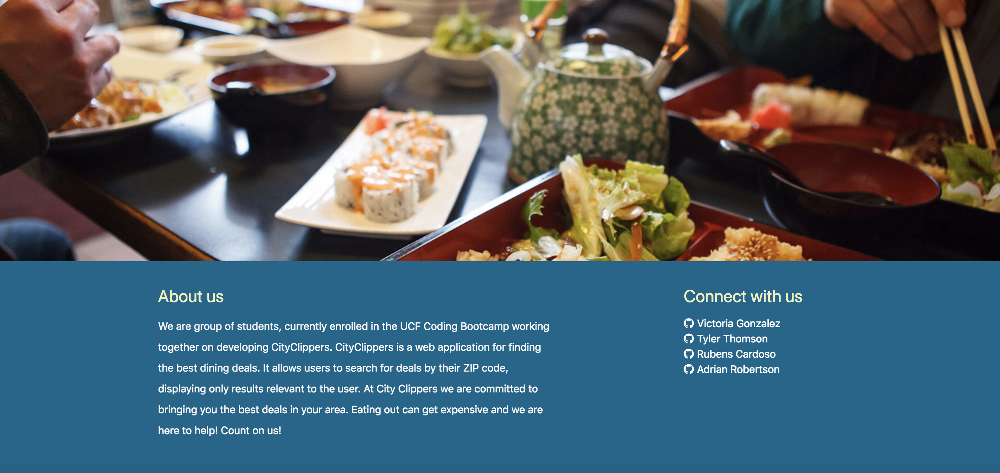

### CityClippers

* Web app for finding the best dining deals.
* Allows users to search for deals by their ZIP code.
* Displays results relevant to the user.
* Allows users to subscribe to emailed coupons.

### Getting Started
The app can be found by clicking [here!](https://victoriagoesplaces.github.io/CityClippers/?zip=34734&action=#!)

### Built With
* [Firebase](https://firebase.google.com/) - Used as the project database
* [Discount API](https://discountapi.com/) - The API used for finding deals
* [Google Maps API](https://cloud.google.com/maps-platform/) - The API for mapping each deal's location
* [Materialize](http://materializecss.com/) - Main css Framework
* [Bootstrap](http://materializecss.com/) - css Framework (Admin Page)

### Authors
* Victoria Gonzalez - [VictoriaGoesPlaces](https://github.com/victoriagoesplaces)
* Tyler Thomson - [thomson3914](https://github.com/thomson3914)
* Rubens Cardoso - [rCardoso89](https://github.com/rcardoso89)
* Adrian Robertson- [robertssoaa](https://github.com/robertssoaa)

### Screenshots

Home Page view #1

Home Page view #2

Home Page view #3

Home Page view #4

